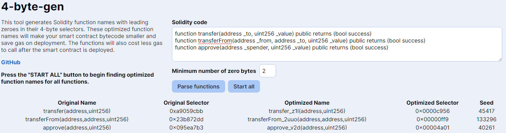

# 4-byte-gen

Simple web app to generate optimized function selectors for Solidity.

Similar projects:
- [jeffreyscholz/solidity-zero-finder-rust](https://github.com/jeffreyscholz/solidity-zero-finder-rust)
- [emn178/solidity-optimize-name](https://github.com/emn178/solidity-optimize-name)
- [quartz-technology/sigop](https://github.com/quartz-technology/sigop)

## Example

1. Input the standard [ERC-20](https://ercs.ethereum.org/ERCS/erc-20) functions `transfer`, `transferFrom`, and `approve`. You can copy the function definition directly from your Solidity code without modification.
2. Adjust "Minimum number of zero bytes" to the desired number of zero bytes to mine for. Check out [`4-byte-gas-test`](https://4-byte-gas.ardis.lu/) for a comparison of gas costs between functions with zero bytes.
3. Click "Parse functions" and the tool will normalize the function definitions (i.e., remove spaces, input names, and extraneous keywords).
4. Click "Start all" and the tool will start mining for optimized function names (each function is mined using its own [web worker](https://developer.mozilla.org/en-US/docs/Web/API/Web_Workers_API), so they are mined in parallel).
